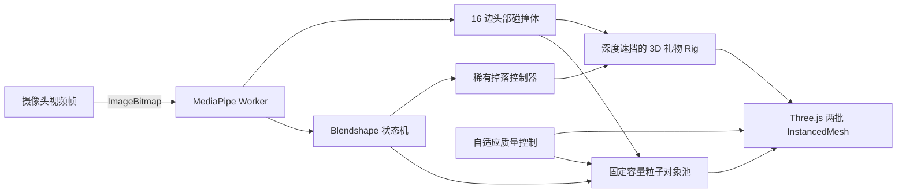

# Smile Storm / 表情天气实验

Smile Storm 是一个独立的浏览器端直播打赏 AR 原型：微笑时持续下雨，大笑时停止下雨并发射烟花；烟花粒子会与实时头部轮廓碰撞，用户可以摆头把粒子撞开。天气特效期间还会低概率掉落有真实厚度与头部前后遮挡关系的 Three.js 墨镜、礼帽或行星环，每次只展示 1 秒。

## 体验流程

1. 使用 PC Chrome 打开 HTTPS 页面，点击“开始体验”并允许摄像头。
2. 正对镜头、保持自然表情，完成中性基线校准。
3. 微笑召唤带循环雨声的雨幕；张嘴大笑触发五枚依次升空、分时绽放的烟花，每次触发只播放一次烟花声。摆动头部可把粒子撞开，首次烟花还会额外播放一次惊讶音效。
4. 无需点选礼物：下雨时按 6%/秒的连续概率抽取，烟花每次按 18% 概率抽取；命中后随机显示一件礼物 1 秒，并有 3 秒冷却。礼物会随头部位置、尺寸和滚转实时更新。
5. 开发验收时使用 `?debug=1` 显示 FPS、推理耗时、特效延迟、粒子数和当前降级档位；正式体验不暴露调试控件。

摄像头帧、面部关键点和 blendshape 数据只在当前浏览器内存中处理，不上传、不录制、不持久化。

## 本地运行

要求 Node.js `>=22.13.0`。

```bash
pnpm install --frozen-lockfile
pnpm dev
```

访问 `http://localhost:3000`。localhost 属于浏览器安全上下文，可调用摄像头；非本机部署必须使用 HTTPS。

```bash
pnpm test         # 单元/回放/产物测试 + Vinext/Vite 两类生产构建
pnpm build:static # 生成可部署到 GitHub Pages 的 dist-static
pnpm lint
pnpm exec tsc --noEmit
pnpm inspect:weather-core  # 检查首页 GLB 的网格、纹理与材质预算
pnpm optimize:weather-core # 从源 GLB 非破坏生成优化版本
```

无需摄像头的确定性视觉回放：打开 `http://localhost:3000/?debug=1&replay=1`，点击“开始体验”。该模式只用于视觉回归和性能排查，真人表情验收仍使用普通入口。

## 架构



- 识别：MediaPipe Face Landmarker，GPU delegate 失败时自动回退 CPU。
- 触发：EMA 平滑 + 进入持续时间 + 迟滞阈值 + 1.5 秒烟花冷却；大笑优先于微笑，回到中性后才能再次完整触发。
- 碰撞：Face Oval 重采样为平滑 16 边多边形；20 FPS 识别结果在渲染循环内插值到 60 FPS，连续线段碰撞避免高速穿透，并叠加经过限幅的头部速度产生清晰“撞开”反馈。
- 烟花：五枚火箭以 140ms 间隔从画面底部升空，到达头部外侧安全爆点后再均匀径向绽放；火花使用三档窄速度壳、爆点级双色调、空气阻力与重力弧线。
- 渲染：固定 480 容量对象池；Three.js 正交相机使用雨、后景烟花、前景烟花三个实例化批次。后景批次仅用头部椭圆片元裁切建立前后关系，不启用全屏 Bloom；LOW 档会关闭该额外批次与碰撞光晕。
- AR 礼物：鎏金墨镜使用挤压镜框、镜片与镜腿，午夜礼帽使用独立帽冠、帽檐和缎带，星轨使用倾斜 Torus 与低模行星；三者都具有真实 Z 厚度。一个不可见、只写深度的低模头部椭球让镜腿、帽檐或星轨后半部被真人头部自然遮挡，前半部仍可见。
- 掉落规则：正式页面没有礼物佩戴或切换按钮；只有下雨（6%/秒）或烟花（18%/次）命中时随机激活一件，严格持续 1000ms，随后进入 3 秒冷却。`?debug=1` 中保留强制逐件预览按钮，仅用于本地验收。
- 性能预算：礼物与粒子共用同一个 WebGLRenderer 和同一深度缓冲，不创建第二个 WebGL 上下文；全部礼物总三角面低于 1800，LOW 档隐藏礼帽细节并减少行星数量。
- 爆点：根据实时头部碰撞体动态放到人脸左右外侧，避免烟花从头部内部绽放；找不到人脸时使用画面两侧安全位置。
- 音效：首次烟花叠加一次惊讶声；雨声循环，烟花声每次触发只播放一次；状态切换与静音使用 600ms 音量曲线淡出。
- 降级：烟花物理预算按 `120 → 90 → 60` 逐级下降；系统减少动态效果时上限为 36，关闭遮挡/额外光晕并把 AR 循环限制到 30 FPS。首页 3D 空闲时为 30 FPS、交互短时 60 FPS、减少动态效果时 12 FPS，离屏或后台暂停。
- 素材：首页水晶球保留 2.49 MB 源 GLB，并通过 glTF Transform 生成约 624 KB 的 Meshopt/WebP 优化文件，运行时只加载优化版本。

主要代码位于：

- `app/components/SmileStormExperience.tsx`：摄像头生命周期、交互界面、单一渲染循环
- `app/workers/vision.worker.ts`：Face Landmarker 初始化与推理
- `app/lib/expression-machine.ts`：表情状态机
- `app/lib/physics.ts`：头部碰撞体与连续碰撞
- `app/lib/particle-system.ts` / `particle-renderer.ts`：对象池、爆炸物理与 Three.js 实例渲染
- `app/lib/head-accessories.ts`：有厚度的低模几何、头部深度遮挡、锚定、质量降级和资源释放
- `app/lib/accessory-drop-controller.ts`：天气事件概率、1000ms 生命周期和 3 秒冷却
- `app/lib/effect-audio.ts`：一次性音效、循环声、Chrome 解锁与无 React 重渲染淡出
- `app/lib/expression-replay.ts` / `performance-replay.ts`：确定性表情回放与 60 秒粒子负载测试

## 兼容性与已知限制

- 主验收环境：Windows 11、当前稳定版 Chrome、i5-1135G7 / Iris Xe 或同级、720p 摄像头。
- V1 同时评估至多两张人脸，并按脸部面积与画面中心距离选择唯一主目标。
- 首次进入需从 CDN 下载约 12 MB 的人脸模型与 WASM，之后可由浏览器缓存。
- Safari、Firefox 和移动端仅做兼容性尝试，不作为本期性能硬门槛。
- 低光、强逆光、严重遮挡会降低表情识别稳定性。
- 当前自动化环境无法代替真人摄像头验收；目标机器的 60 秒现场测试方法见 [docs/PERFORMANCE.md](docs/PERFORMANCE.md)。

## 隐私与安全

- 摄像头只能由用户点击后请求，并可随时通过“结束体验”释放。
- 页面离开、失败或重试时会终止媒体轨道、推理 Worker、动画帧和 WebGL 资源。
- 不包含分析 SDK、上传接口、数据库或持久化存储。
- 运行时模型来自 Google MediaPipe 官方模型地址，WASM 固定至 `@mediapipe/tasks-vision@0.10.35`。

## 文档

- [性能与验收记录](docs/PERFORMANCE.md)
- [Vibecoding 复盘](VIBECODING.md)
- [第三方依赖声明](THIRD_PARTY_NOTICES.md)

## GitHub Pages

仓库内置 `.github/workflows/deploy-pages.yml`。将本项目推送到 Public GitHub 仓库的 `main` 分支，并在 **Settings → Pages → Build and deployment** 选择 **GitHub Actions**；工作流会测试并发布 `dist-static`。静态构建使用相对资源路径，可部署在 `https://<user>.github.io/<repo>/` 子目录中，摄像头会在 HTTPS 安全上下文中工作。

本项目代码以 [MIT License](LICENSE) 发布；第三方依赖遵循各自许可证。
